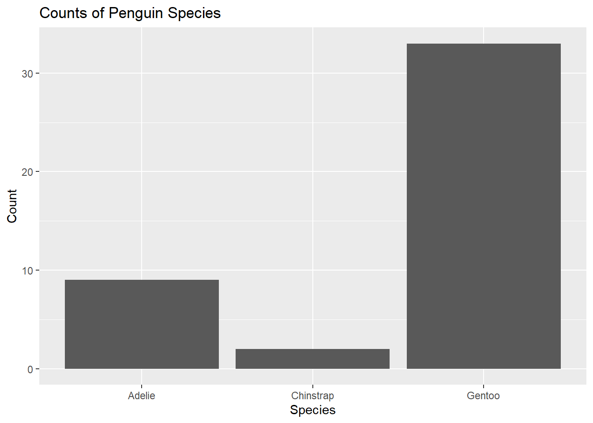

# Palmer Penguin Analysis

This is an analysis of the Palmer Penguin's data set.

## Loading Packages & Data Sets

Here we will load the tidyverse package and penguin data.


::: {.cell}

```{.r .cell-code}
#Load the tidyverse
library(tidyverse)
```

::: {.cell-output .cell-output-stderr}
```
── Attaching packages ─────────────────────────────────────── tidyverse 1.3.2 ──
✔ ggplot2 3.4.0      ✔ purrr   1.0.0 
✔ tibble  3.1.8      ✔ dplyr   1.0.10
✔ tidyr   1.2.1      ✔ stringr 1.5.0 
✔ readr   2.1.3      ✔ forcats 0.5.2 
── Conflicts ────────────────────────────────────────── tidyverse_conflicts() ──
✖ dplyr::filter() masks stats::filter()
✖ dplyr::lag()    masks stats::lag()
```
:::

```{.r .cell-code}
library(kableExtra)
```

::: {.cell-output .cell-output-stderr}
```

Attaching package: 'kableExtra'

The following object is masked from 'package:dplyr':

    group_rows
```
:::

```{.r .cell-code}
#Read the penguins_samp1 data file from github
penguins <- read_csv("https://raw.githubusercontent.com/mcduryea/Intro-to-Bioinformatics/main/data/penguins_samp1.csv")
```

::: {.cell-output .cell-output-stderr}
```
Rows: 44 Columns: 8
── Column specification ────────────────────────────────────────────────────────
Delimiter: ","
chr (3): species, island, sex
dbl (5): bill_length_mm, bill_depth_mm, flipper_length_mm, body_mass_g, year

ℹ Use `spec()` to retrieve the full column specification for this data.
ℹ Specify the column types or set `show_col_types = FALSE` to quiet this message.
```
:::

```{.r .cell-code}
#See the first six rows of the data we've read in to our notebook
penguins %>% 
  head(2) %>%
  kable() %>% 
  kable_styling(c("striped", "hover"))
```

::: {.cell-output-display}

`````{=html}
<table class="table table-striped table-hover" style="margin-left: auto; margin-right: auto;">
 <thead>
  <tr>
   <th style="text-align:left;"> species </th>
   <th style="text-align:left;"> island </th>
   <th style="text-align:right;"> bill_length_mm </th>
   <th style="text-align:right;"> bill_depth_mm </th>
   <th style="text-align:right;"> flipper_length_mm </th>
   <th style="text-align:right;"> body_mass_g </th>
   <th style="text-align:left;"> sex </th>
   <th style="text-align:right;"> year </th>
  </tr>
 </thead>
<tbody>
  <tr>
   <td style="text-align:left;"> Gentoo </td>
   <td style="text-align:left;"> Biscoe </td>
   <td style="text-align:right;"> 59.6 </td>
   <td style="text-align:right;"> 17 </td>
   <td style="text-align:right;"> 230 </td>
   <td style="text-align:right;"> 6050 </td>
   <td style="text-align:left;"> male </td>
   <td style="text-align:right;"> 2007 </td>
  </tr>
  <tr>
   <td style="text-align:left;"> Gentoo </td>
   <td style="text-align:left;"> Biscoe </td>
   <td style="text-align:right;"> 48.6 </td>
   <td style="text-align:right;"> 16 </td>
   <td style="text-align:right;"> 230 </td>
   <td style="text-align:right;"> 5800 </td>
   <td style="text-align:left;"> male </td>
   <td style="text-align:right;"> 2008 </td>
  </tr>
</tbody>
</table>

`````

:::
:::


## About Our Data

The data we are working with is a data set on Penguins, which includes 8 features measured on 44 penguins. The features included are physiological features (like bill length, bill depth, flipper length, body mass, etc) as well as other features like the year that the penguin was observed, the island the penguin was observed on, the sex of the penguin, and the species of the penguin.

## Interesting Questions to Ask

-   What is the average flipper length? What about for each species?

-   Are there more male or female penguins? What about per island or species?

-   What is the average body mass? What about by island? By species? By sex?

-   What is the ratio of bill length to bill depth for a penguin? What is the overall average of this metric? Does it change by species, sex, or island?

-   Does average body mass change by year?

    ## Data Manipulation Tools and Strategies

    We can look at individual columns in a data set or subsets of columns in a data set. For example, if we are only interested in flipper length and species, we can `select()` those columns.


    ::: {.cell}
    
    ```{.r .cell-code}
    penguins %>%
      count(island)
    ```
    
    ::: {.cell-output .cell-output-stdout}
    ```
    # A tibble: 3 × 2
      island        n
      <chr>     <int>
    1 Biscoe       36
    2 Dream         3
    3 Torgersen     5
    ```
    :::
    :::

::: {.cell}

```{.r .cell-code}
penguins %>%
  count(island, species) %>%
  pivot_wider(names_from = species, values_from = n, values_fill = 0) %>%
  kable() %>%
  kable_styling(bootstrap_options = c("hover", "striped"))
```

::: {.cell-output-display}

`````{=html}
<table class="table table-hover table-striped" style="margin-left: auto; margin-right: auto;">
 <thead>
  <tr>
   <th style="text-align:left;"> island </th>
   <th style="text-align:right;"> Adelie </th>
   <th style="text-align:right;"> Gentoo </th>
   <th style="text-align:right;"> Chinstrap </th>
  </tr>
 </thead>
<tbody>
  <tr>
   <td style="text-align:left;"> Biscoe </td>
   <td style="text-align:right;"> 3 </td>
   <td style="text-align:right;"> 33 </td>
   <td style="text-align:right;"> 0 </td>
  </tr>
  <tr>
   <td style="text-align:left;"> Dream </td>
   <td style="text-align:right;"> 1 </td>
   <td style="text-align:right;"> 0 </td>
   <td style="text-align:right;"> 2 </td>
  </tr>
  <tr>
   <td style="text-align:left;"> Torgersen </td>
   <td style="text-align:right;"> 5 </td>
   <td style="text-align:right;"> 0 </td>
   <td style="text-align:right;"> 0 </td>
  </tr>
</tbody>
</table>

`````

:::
:::


## Answering Our Questions

Most of our questions involve summarizing data, and perhaps summarizing over groups. We can summarize data using the `summarize()` function, and group data using `group_by()`.

Let's find the average flipper length.


::: {.cell}

```{.r .cell-code}
penguins %>% #average for all species
  summarize(avg_flipper_length = mean(flipper_length_mm))
```

::: {.cell-output .cell-output-stdout}
```
# A tibble: 1 × 1
  avg_flipper_length
               <dbl>
1               212.
```
:::

```{.r .cell-code}
penguins %>% #single species avg length
  filter(species == "Gentoo") %>%
  summarize(avg_flipper_length = mean(flipper_length_mm))
```

::: {.cell-output .cell-output-stdout}
```
# A tibble: 1 × 1
  avg_flipper_length
               <dbl>
1               218.
```
:::

```{.r .cell-code}
penguins %>% #average separated by species (grouped average)
  group_by(species) %>%
  summarize(avg_flipper_length = mean(flipper_length_mm))
```

::: {.cell-output .cell-output-stdout}
```
# A tibble: 3 × 2
  species   avg_flipper_length
  <chr>                  <dbl>
1 Adelie                  189.
2 Chinstrap               200 
3 Gentoo                  218.
```
:::
:::


How many of each species do we have?


::: {.cell}

```{.r .cell-code}
penguins %>%
  count(sex)
```

::: {.cell-output .cell-output-stdout}
```
# A tibble: 2 × 2
  sex        n
  <chr>  <int>
1 female    20
2 male      24
```
:::
:::


We can use `mutate()` to add new columns to our data set.


::: {.cell}

```{.r .cell-code}
#To make a permanent change, we need to store the results of our manipulations
penguins_with_ratio <- penguins %>%
  mutate(bill_ltd_ratio = bill_length_mm / bill_depth_mm)

#Average Ratio
penguins %>%
  mutate(bill_ltd_ratio = bill_length_mm / bill_depth_mm) %>%
  summarize(mean_bill_ltd_ratio = mean(bill_ltd_ratio),
            median_bill_ltd_ratio = median(bill_ltd_ratio))
```

::: {.cell-output .cell-output-stdout}
```
# A tibble: 1 × 2
  mean_bill_ltd_ratio median_bill_ltd_ratio
                <dbl>                 <dbl>
1                2.95                  3.06
```
:::
:::

::: {.cell}

```{.r .cell-code}
penguins %>%
  summarize(mean_bill_length_mm = mean(bill_length_mm, na.rm = TRUE),
  min_bill_length = min(bill_length_mm, na.rm = TRUE),
  first_quartile_bill_length = quantile(bill_length_mm, 0.25, na.rm = TRUE),
  median_bill_length = median(bill_length_mm, na.rm = TRUE), 
  mean_bill_length_mm = mean(bill_length_mm, na.rm = TRUE), third_quartile_bill_length = quantile(bill_length_mm, 0.75, na.rm = TRUE),
  standard_deviation_bill_length = sd(bill_length_mm, na.rm = TRUE)) %>%
  pivot_longer(cols = everything())
```

::: {.cell-output .cell-output-stdout}
```
# A tibble: 6 × 2
  name                           value
  <chr>                          <dbl>
1 mean_bill_length_mm            46.4 
2 min_bill_length                36.2 
3 first_quartile_bill_length     44.6 
4 median_bill_length             46.4 
5 third_quartile_bill_length     49.1 
6 standard_deviation_bill_length  4.93
```
:::
:::


Average body mass per year


::: {.cell}

```{.r .cell-code}
penguins %>%
  group_by(year) %>%
  summarize(mean_body_mass = mean(body_mass_g))
```

::: {.cell-output .cell-output-stdout}
```
# A tibble: 3 × 2
   year mean_body_mass
  <dbl>          <dbl>
1  2007          5079.
2  2008          4929.
3  2009          4518.
```
:::
:::


## Data Visualization

-   What is the distribution of penguin flipper lengths?

-   What is the distribution of penguin species?

-   Does the distribution of flipper length depend on the species of penguin?


::: {.cell}

```{.r .cell-code}
penguins %>%
  ggplot() +
  geom_bar(mapping = aes(x = species)) +
  labs(title ="Counts of Penguin Species", x = "Species", y = "Count")
```

::: {.cell-output-display}
{width=672}
:::
:::

::: {.cell}

```{.r .cell-code}
penguins %>%
  ggplot() +
  geom_histogram(mapping = aes(x = bill_length_mm), color = "white", fill = "blue") +
  labs(title ="Distribution of Bill Lengths", x = "Bill Length (mm)", y = "Count")
```

::: {.cell-output .cell-output-stderr}
```
`stat_bin()` using `bins = 30`. Pick better value with `binwidth`.
```
:::

::: {.cell-output-display}
{width=672}
:::
:::

::: {.cell}

```{.r .cell-code}
penguins %>%
  ggplot() +
  geom_histogram( aes(x = flipper_length_mm),
                  bins = 15,
                  fill = "forestgreen",
                    color = "black") +
  labs(title = "Distribution of Flipper Length (mm)",
       subtitle = "Mean in Black, Median in Purple",
       y = "", x = "Flipper Length (mm)") +
    geom_vline(aes(xintercept = mean(flipper_length_mm)), lwd = 2, lty = "dashed") +
    geom_vline(aes(xintercept = median(flipper_length_mm)), lwd = 2, lty = "dotted", color = "purple") 
```

::: {.cell-output .cell-output-stderr}
```
Warning: Using `size` aesthetic for lines was deprecated in ggplot2 3.4.0.
ℹ Please use `linewidth` instead.
```
:::

::: {.cell-output-display}
{width=672}
:::
:::


We will now look at the distribution of species.


::: {.cell}

```{.r .cell-code}
penguins %>%
  ggplot() +
  geom_bar(mapping = aes(x = species), color ="black", fill="blue") +
  labs(title = "Counts of Penguin Species", x = "Species", y = "Count")
```

::: {.cell-output-display}
{width=672}
:::
:::


Let's make a scatter plot to see if bill length is correlated with bill depth.


::: {.cell}

```{.r .cell-code}
penguins %>%
  ggplot() +
  geom_point(aes(x =bill_length_mm, y = bill_depth_mm, color = species)) +
  geom_smooth(aes(x =bill_length_mm, y = bill_depth_mm, color = species), method = "lm")
```

::: {.cell-output .cell-output-stderr}
```
`geom_smooth()` using formula = 'y ~ x'
```
:::

::: {.cell-output .cell-output-stderr}
```
Warning in qt((1 - level)/2, df): NaNs produced
```
:::

::: {.cell-output .cell-output-stderr}
```
Warning in max(ids, na.rm = TRUE): no non-missing arguments to max; returning
-Inf
```
:::

::: {.cell-output-display}
{width=672}
:::
:::
